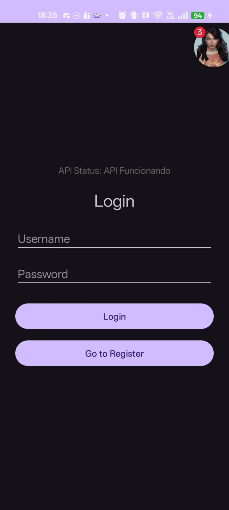
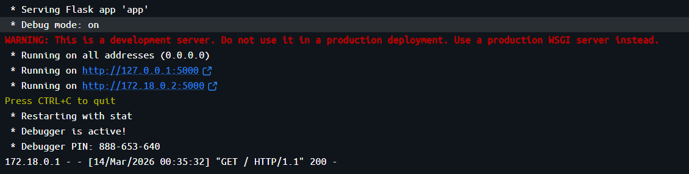
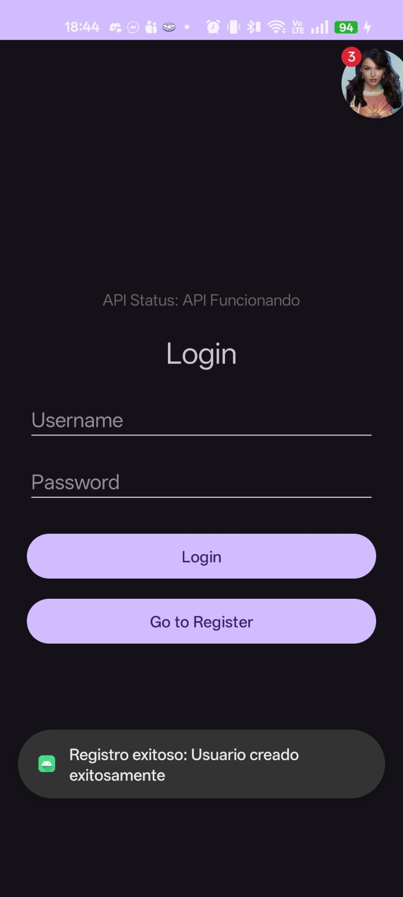
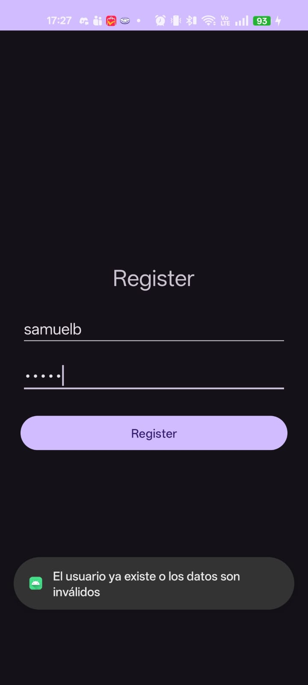
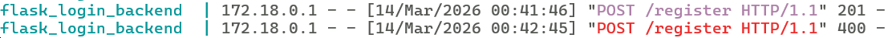
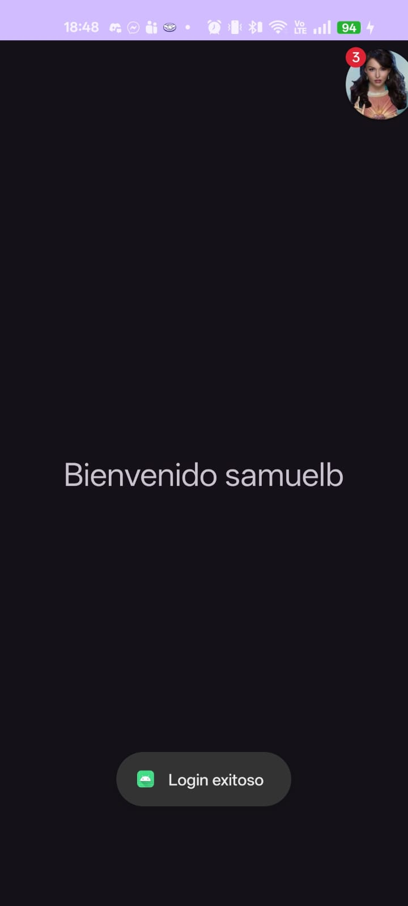
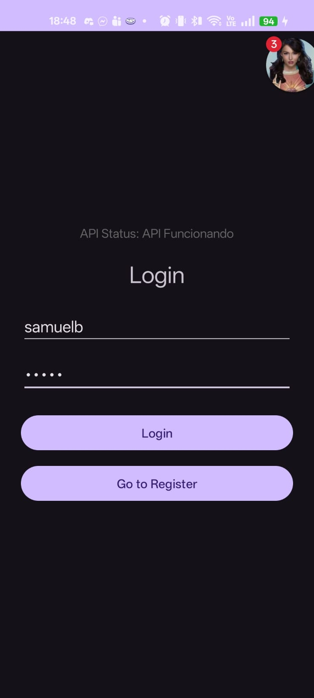
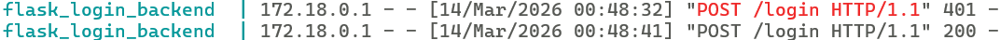
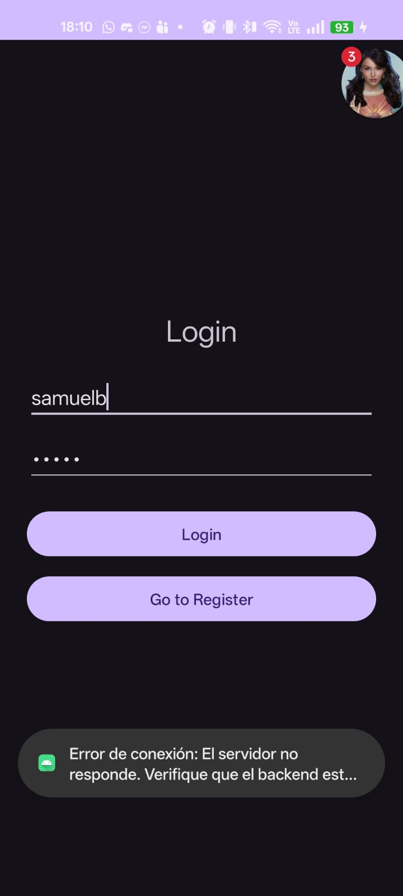

# Tarea 3: Consumo de una API REST dockerizada desde Android

Este tarea consiste en una aplicación Android que consume un servicio REST dockerizado (Python/Flask) para la gestión de usuarios.

## Requisitos Previos
* **Docker Desktop** instalado y en ejecución.
* **Android Studio** (API 24 o superior recomendado).
* **Dispositivo físico Android** conectado a la misma red Wi-Fi que la PC.

---

## Pasos para compilar y ejecutar

### 1. Levantar el Backend (Referencia)
1. Abre una terminal y navega a la carpeta del backend:
     ```bash
     cd "Back/Docker-Flask/ORM"

2. Construye y levanta el contenedor utilizando Docker Compose:
     ```bash
     docker compose up --build

3. El servicio estará disponible en http://localhost:5000.

### 2. Configuración para Dispositivo Físico
Al utilizar un teléfono externo, se realizaron los siguientes pasos de configuración:

Se verificó que el teléfono y la PC estuvieran en la misma red Wi-Fi.

Se obtuvo la dirección IPv4 de la PC mediante el comando ipconfig.

Se actualizó el archivo RetrofitClient.kt para usar la IP de la PC: http://<IP-DE-TU-PC>:5000.
El código esta configurado para funcionar directamente con la 10.0.2.2:5000, pero una liena de código abajo está comentado la IPv4 de mi red LAN.

Se configuró android:usesCleartextTraffic="true" en el AndroidManifest.xml para permitir tráfico HTTP.


## Evidencias de los Ejercicios Desarrollados
### Ejercicio 1: 
Conexión y verificación de la API Se realiza una petición GET al endpoint raíz (/) al iniciar la aplicación.



### Ejercicio 2: 
Pantalla de Registro Se envía una petición POST a /register con un cuerpo JSON.Caso Exitoso: 




### Ejercicio 3: 
Pantalla de Login Se envía una petición POST a /login. Al autenticar correctamente, navega a la pantalla de bienvenida.Flujo Completo: 
Flujo: Login -> Welcome





### Ejercicio 4: 
Manejo de errores de red Se detuvo el contenedor Docker (docker compose down) mientras la app estaba abierta. La aplicación capturó la excepción de red y mostró un mensaje amigable.

